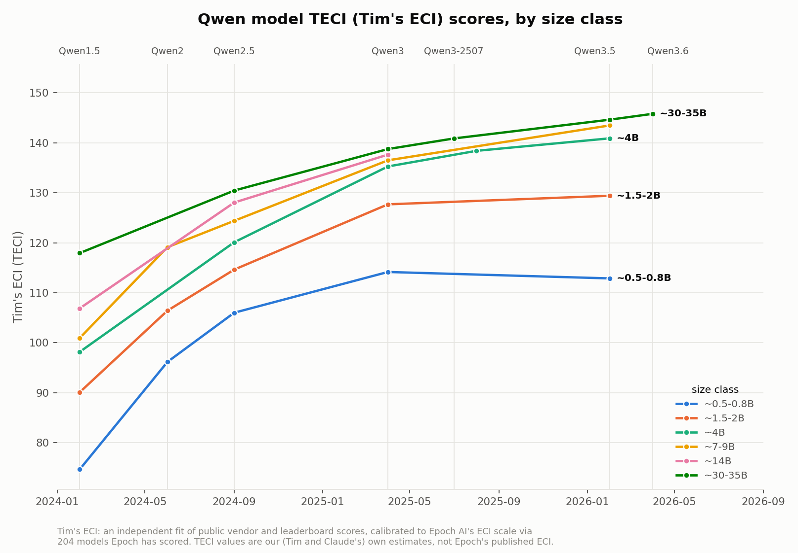

# TECI — small language models on the Epoch Capabilities Index scale

Is capability progress slower for small models than for large ones?

Epoch AI's [Capabilities Index](https://epoch.ai/data/eci-documentation) (ECI) puts
models on one capability scale by fitting an item-response model across ~57
benchmarks, so models evaluated years apart on different benchmarks stay
comparable. It mostly covers frontier models. This project extends that scale
down to small open models — 0.5B to 35B, six families, 2023 to 2026 — to see
whether the small tier is falling behind.

**Headline:** the ≤2B tier improves at about **13.8 TECI/yr** against **15.1** for
the >10B tier. So yes, small models advance more slowly — but by less than half
as much as Qwen and Gemma alone suggest, which is the more interesting result.
Calibrating the low end on two vendors' own reported scores overstates the gap.



## TECI is not ECI

Values here are **our estimates**, labelled **TECI** ("Tim's ECI") — the naming
follows the convention Anthropic uses for their own internal variant, the
"Anthropic ECI". They are calibrated onto
Epoch's scale via 204 models Epoch has scored (r=0.9998), so they are meant to be
read against published ECI. What differs is coverage: Epoch has not scored most
of the small models here, and where it *has* (18 of our 123 entries, which act as
calibration anchors) we still plot our own fitted value rather than theirs.

## What's here

| | |
|---|---|
| `data/results_methods.csv` | 123 entries scored three ways, with bootstrap CIs |
| `charts/` | rendered figures |
| `docs/connectivity_audit.md` | does the model × benchmark graph hang together, and on what assumptions |
| `docs/sensitivity.md` | how far the answer moves when each flagged assumption is reversed |
| `docs/tier_trends.md` | per-family, per-tier trends — the table view of the charts |
| `CLAUDE.md` | full pipeline order, conventions, and every open caveat |

Three fitting methods are run and reported together, because agreeing answers
from different grafting strategies is most of the evidence that the graft works:
**A** jointly refits our observations with Epoch's full matrix (headline),
**B** holds Epoch's published benchmark parameters fixed, **C** fits our data
alone and maps it on via shared models. They agree to r≥0.993.

## Running it

```bash
python -m venv .venv && .venv/Scripts/pip install -r requirements.txt   # Windows
python -m venv .venv && .venv/bin/pip install -r requirements.txt       # POSIX
```

Refresh Epoch's published data (run from anywhere):

```bash
python scripts/fetch_epoch.py
```

The rest use flat relative paths and must be run **from `data/`**:

```bash
cd data && python ../scripts/prep_obs.py && python ../scripts/fit_methods.py
```

`fit_methods.py` takes roughly ten minutes — method A fits ~3,650 observations
over 678 parameters and then bootstraps it 100 times. Chart scripts write PNGs
into the working directory; move them to `charts/`. See `CLAUDE.md` for the full
pipeline order.

## Known limitations

Stated up front because they bound what the numbers can support.

- **The recent small-model points rest on vendor-reported scores.** Our 2025+
  sub-2B entries are scored almost entirely on Qwen's and Google's own published
  benchmark numbers, not on an independent harness. The Open LLM Leaderboard,
  which supplies our cross-family coverage, froze in March 2025; LiveBench has
  nothing below ~3.8B; Epoch's low-end coverage is all 2018–2022 benchmarks. So
  the cross-family de-biasing improves the 2023–2024 span of the trend and cannot
  speak to its most recent points.
- **Vendor-reported scores run optimistic.** On the three thinking-mode models
  where a published ECI exists to check against, method A reads +0.7 to +3.6 high.
- **The item-response model assumes one latent capability.** A small model
  post-trained hard on the benchmarks in the fit will score above its general
  capability, and nothing here can detect that.
- **Confidence intervals cover sampling noise only** — which benchmarks a model
  happened to be evaluated on — not harness differences or the point above.
- **The size-gap number depends on where you cut the tier.** 1.96 TECI/yr for
  0.5–2B; 1.26 if sub-0.5B models are included. `docs/tier_trends.md` gives both.

## Data sources and licensing

- **Epoch AI** — ECI scores, benchmark matrix, and EDI values, downloaded by
  `scripts/fetch_epoch.py` with URLs and sha256s recorded in `data/raw/FETCHED.txt`.
  Epoch's data is published under [Creative Commons
  Attribution](https://epoch.ai/benchmarks/use-this-data); some benchmarks within
  it come from external sources under their own terms (Aider Polyglot and
  Terminal-Bench are Apache 2.0).
- **`eci-upstream/`** — a vendored copy of
  [epoch-research/eci-public](https://github.com/epoch-research/eci-public),
  MIT licensed, © 2025 Epoch AI. License included at `eci-upstream/LICENSE`.
  Used unmodified, as the reference for the fitting spec and chance-level table.
- **Open LLM Leaderboard** — the
  [contents dataset](https://huggingface.co/datasets/open-llm-leaderboard/contents)
  declares no license, so the raw parquet is not committed here;
  `scripts/add_oll_models.py` downloads it and `data/raw/OLL_SOURCE.txt` records
  the URL and sha256.
- **Vendor benchmark scores** — from published model cards, blog posts and
  technical reports (Qwen, Google), transcribed into
  `data/qwen_gemma_benchmarks.xlsx` with a source cited per row.
- **LiveBench** — official leaderboard CSVs from [livebench.ai](https://livebench.ai).

This project is not affiliated with or endorsed by Epoch AI.
